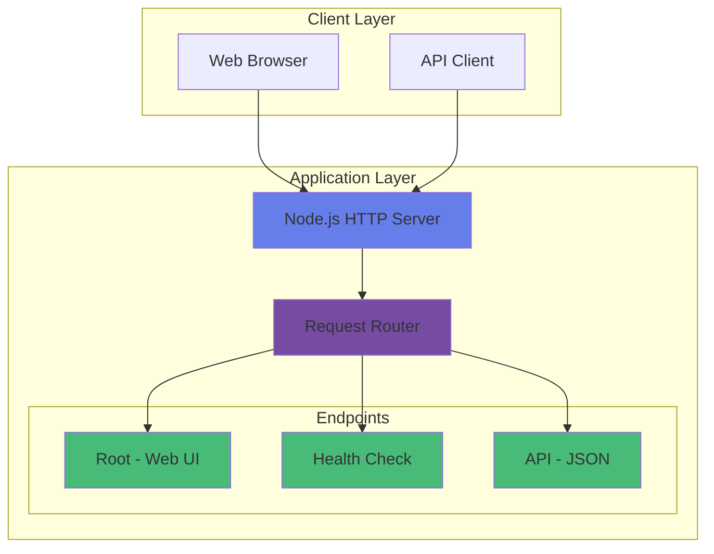
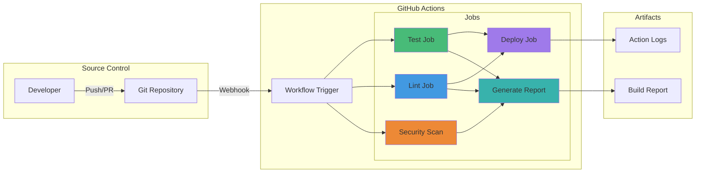
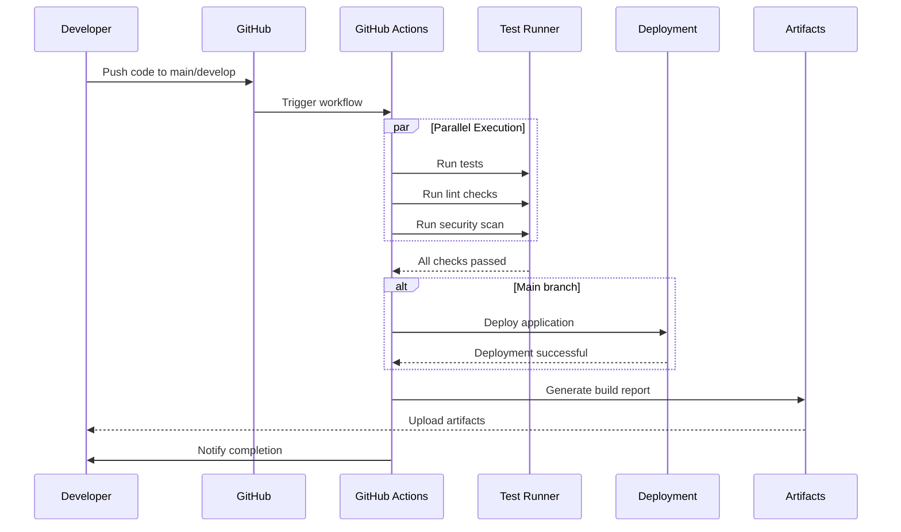
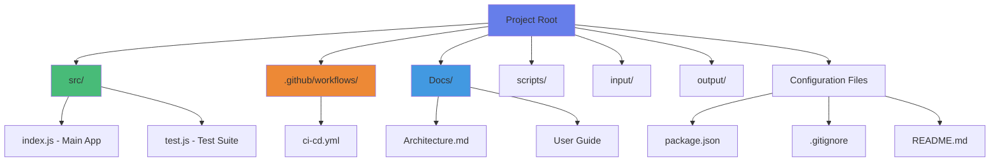
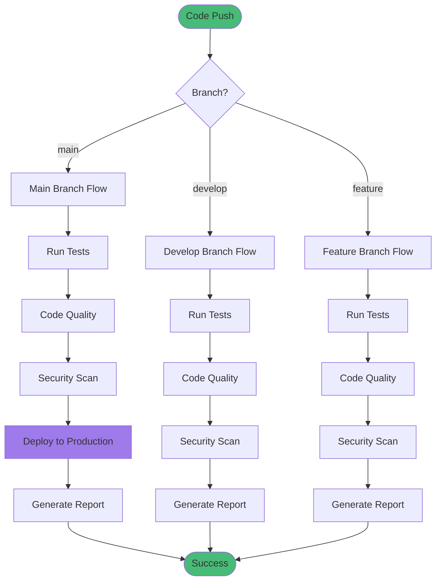
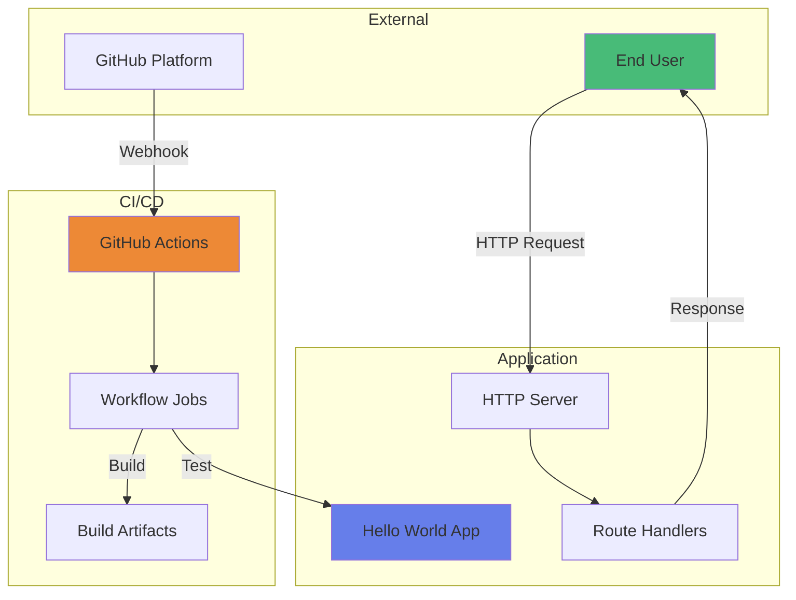
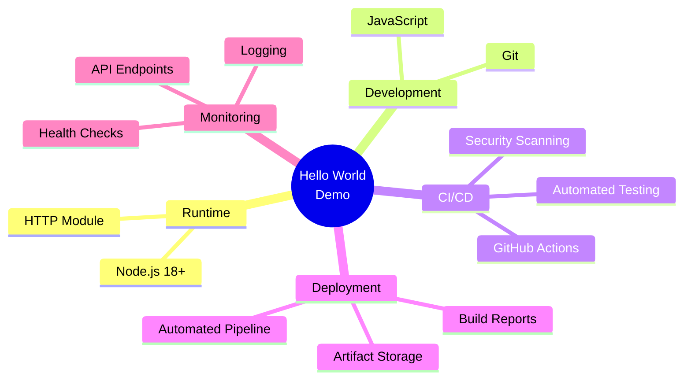

# Architecture Documentation

## System Overview

This document describes the architecture of the Hello World GitHub Actions Demo application, including the CI/CD pipeline, application structure, and deployment workflow.

## Application Architecture

## CI/CD Pipeline Architecture

## Workflow Execution Flow

## Project Structure

## Deployment Flow

## Component Interaction

## Technology Stack

## Key Features

### 1. **Application Features**
- Simple HTTP server with multiple endpoints
- Health check endpoint for monitoring
- JSON API for programmatic access
- Beautiful web UI with responsive design
- Graceful shutdown handling

### 2. **CI/CD Features**
- Automated testing on every push
- Code quality checks
- Security vulnerability scanning
- Automated deployment to main branch
- Build report generation
- Artifact retention

### 3. **GitHub Actions Integration**
- Multi-job parallel execution
- Conditional deployment
- Artifact upload and storage
- Comprehensive logging
- Status notifications

## Security Considerations

1. **Dependency Management**: Regular security audits via `npm audit`
2. **Access Control**: GitHub Actions uses repository secrets
3. **Branch Protection**: Main branch requires passing checks
4. **Artifact Retention**: Build reports stored for 30 days

## Scalability

The architecture is designed to be easily scalable:

- **Horizontal Scaling**: Multiple server instances can be deployed
- **CI/CD Pipeline**: Can be extended with additional jobs
- **Monitoring**: Health endpoints ready for integration with monitoring tools
- **Deployment**: Can be adapted for various hosting platforms

## Future Enhancements

1. Add Docker containerization
2. Implement database integration
3. Add authentication and authorization
4. Integrate with MCP Registry for server publishing
5. Add performance monitoring
6. Implement blue-green deployment strategy

---

**Last Updated**: 2026-05-07  
**Version**: 1.0.0