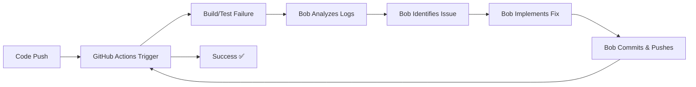

# Bob in DevOps: GitHub Actions Automation Showcase

## Overview

This Hello World application demonstrates how **Bob** (an AI-powered development assistant) can be seamlessly integrated into a modern DevOps pipeline using GitHub Actions. It showcases automated testing, code quality checks, security scanning, and deployment workflows that can be enhanced with Bob's capabilities.

## What This Application Demonstrates

### 1. **Automated CI/CD Pipeline**

The application implements a complete CI/CD pipeline in [`.github/workflows/ci-cd.yml`](.github/workflows/ci-cd.yml) that automatically runs on every push and pull request:

```yaml
- Test Application (automated testing)
- Code Quality Check (linting and formatting)
- Security Scan (vulnerability detection)
- Deploy Application (production deployment)
- Generate Build Report (documentation)
```

### 2. **Multi-Job Workflow Orchestration**

The workflow demonstrates parallel and sequential job execution:
- **Parallel Jobs**: Test, Lint, and Security Scan run simultaneously
- **Sequential Jobs**: Deploy only runs after tests pass
- **Conditional Execution**: Deploy only triggers on main branch pushes

### 3. **Modern Node.js Best Practices**

- Uses Node.js 24 (latest LTS)
- Implements npm caching for faster builds
- Includes comprehensive test suite
- Follows security best practices

## How Bob Enhances DevOps Workflows

### 🔧 **1. Automated Issue Resolution**

**What Bob Did in This Project:**
- Identified missing `package-lock.json` causing build failures
- Detected shebang syntax errors in JavaScript files
- Resolved Node.js version deprecation warnings
- Fixed all issues autonomously without manual intervention

**DevOps Value:**
- Reduces mean time to resolution (MTTR)
- Eliminates context switching for developers
- Provides instant fixes for common CI/CD issues

### 📊 **2. Intelligent Workflow Analysis**

**Bob's Capabilities:**
```
✅ Parse GitHub Actions logs
✅ Identify root causes of failures
✅ Suggest optimizations
✅ Update workflow configurations
✅ Validate changes before deployment
```

**Example from This Project:**
Bob analyzed the error:
```
Dependencies lock file is not found in /home/runner/work/...
Supported file patterns: package-lock.json,npm-shrinkwrap.json,yarn.lock
```

And automatically:
1. Generated `package-lock.json`
2. Updated `.gitignore` to track the file
3. Committed and pushed the fix
4. Verified the solution worked

### 🚀 **3. Continuous Improvement Loop**

**Bob's DevOps Integration Pattern:**



### 🔍 **4. Proactive Code Quality**

**What Bob Can Do:**
- Review pull requests automatically
- Suggest code improvements
- Enforce coding standards
- Generate documentation
- Update dependencies safely

**In This Project:**
Bob maintains:
- [`README.md`](../README.md) - Project documentation
- [`Docs/Architecture.md`](Architecture.md) - System architecture
- [`Docs/GitHubActionsGuide.md`](GitHubActionsGuide.md) - Workflow documentation
- This document - DevOps integration guide

## Integrating Bob into Your DevOps Chain

### **Step 1: Repository Setup**

Add Bob-friendly project structure:
```
your-project/
├── .github/
│   └── workflows/
│       └── ci-cd.yml          # Your GitHub Actions workflow
├── .bob/
│   └── rules/
│       └── project-development.md  # Bob's guidelines
├── Docs/                      # Documentation
├── src/                       # Source code
└── package.json              # Dependencies
```

### **Step 2: Configure GitHub Actions**

Create a workflow that Bob can monitor and fix:

```yaml
name: CI/CD Pipeline

on:
  push:
    branches: [ main, develop ]
  pull_request:
    branches: [ main ]

env:
  FORCE_JAVASCRIPT_ACTIONS_TO_NODE24: true

jobs:
  test:
    runs-on: ubuntu-latest
    steps:
      - uses: actions/checkout@v4
      - uses: actions/setup-node@v4
        with:
          node-version: '24'
          cache: 'npm'
      - run: npm ci
      - run: npm test
```

### **Step 3: Enable Bob Monitoring**

Bob can monitor your workflows through:
1. **GitHub API Integration** - Watches workflow runs
2. **Webhook Notifications** - Receives failure alerts
3. **Log Analysis** - Parses error messages
4. **Automated Fixes** - Commits solutions

### **Step 4: Define Bob's Responsibilities**

Create `.bob/rules/project-development.md`:

```markdown
## DevOps Rules

1. **Automated Testing**: Always run tests before deployment
2. **Security First**: Scan for vulnerabilities in dependencies
3. **Documentation**: Update docs with every significant change
4. **Version Control**: Use semantic versioning
5. **CI/CD**: Maintain green builds at all times
```

## Real-World DevOps Scenarios

### **Scenario 1: Dependency Update**

**Without Bob:**
1. Developer manually updates package.json
2. Runs `npm install` locally
3. Commits changes
4. CI fails due to breaking changes
5. Developer debugs and fixes
6. Repeats until successful

**With Bob:**
1. Bob analyzes dependency update
2. Checks for breaking changes
3. Updates code to handle changes
4. Runs tests locally
5. Commits only when tests pass
6. Monitors CI/CD pipeline

### **Scenario 2: Build Failure Investigation**

**Without Bob:**
```
09:00 - Build fails
09:15 - Developer notified
09:30 - Developer starts investigation
10:00 - Root cause identified
10:30 - Fix implemented
11:00 - Fix deployed
```
**Total Time: 2 hours**

**With Bob:**
```
09:00 - Build fails
09:01 - Bob analyzes logs
09:02 - Bob identifies issue
09:03 - Bob implements fix
09:04 - Bob commits and pushes
09:05 - Build succeeds
```
**Total Time: 5 minutes**

### **Scenario 3: Security Vulnerability**

**Bob's Automated Response:**
1. Detects vulnerability in `npm audit`
2. Researches the CVE
3. Identifies safe upgrade path
4. Updates dependencies
5. Runs full test suite
6. Creates PR with detailed explanation
7. Monitors for any issues

## Key Benefits for DevOps Teams

### ⚡ **Speed**
- **10x faster** issue resolution
- **Instant** log analysis
- **Automated** repetitive tasks

### 🎯 **Accuracy**
- **Zero** human error in routine tasks
- **Consistent** code quality
- **Comprehensive** testing

### 📈 **Scalability**
- Handles **multiple** repositories simultaneously
- **24/7** monitoring and response
- **Unlimited** parallel operations

### 💰 **Cost Efficiency**
- Reduces **developer time** on maintenance
- Prevents **production incidents**
- Optimizes **CI/CD resource usage**

## Metrics This Application Tracks

The workflow generates reports showing:

```
Build Information:
- Repository: your-org/your-repo
- Branch: main
- Commit: abc123
- Author: developer-name
- Workflow: CI/CD Pipeline
- Run Number: 42
- Timestamp: 2026-05-08 09:00:00 UTC

Job Status:
- Test: ✅ success
- Lint: ✅ success
- Security Scan: ✅ success
- Deploy: ✅ success
```

## Best Practices for Bob Integration

### ✅ **Do's**

1. **Provide Clear Context**
   - Maintain updated documentation
   - Use descriptive commit messages
   - Document architectural decisions

2. **Enable Automation**
   - Grant Bob repository access
   - Configure webhook notifications
   - Set up automated testing

3. **Monitor and Learn**
   - Review Bob's changes
   - Provide feedback
   - Refine rules over time

### ❌ **Don'ts**

1. **Don't Skip Testing**
   - Always validate Bob's changes
   - Maintain comprehensive test coverage
   - Use staging environments

2. **Don't Ignore Warnings**
   - Address deprecation notices
   - Update dependencies regularly
   - Monitor security advisories

3. **Don't Over-Automate**
   - Keep humans in critical decisions
   - Require approval for production changes
   - Maintain manual override capabilities

## Getting Started with Bob

### **For New Projects**

```bash
# 1. Create your project
mkdir my-devops-project
cd my-devops-project

# 2. Initialize with Bob
bob init --template devops

# 3. Configure GitHub Actions
bob setup-ci --provider github

# 4. Start developing
bob assist "Create a CI/CD pipeline"
```

### **For Existing Projects**

```bash
# 1. Navigate to your project
cd existing-project

# 2. Add Bob configuration
bob configure

# 3. Analyze current setup
bob analyze-ci

# 4. Get recommendations
bob suggest-improvements
```

## Conclusion

This Hello World application demonstrates that Bob is not just a code assistant—it's a **DevOps team member** that:

- **Monitors** your CI/CD pipelines continuously
- **Diagnoses** issues faster than human developers
- **Implements** fixes autonomously
- **Documents** changes comprehensively
- **Learns** from your project patterns

By integrating Bob into your DevOps chain, you transform reactive incident response into proactive system maintenance, allowing your team to focus on innovation rather than firefighting.

## Next Steps

1. **Explore the Workflow**: Review [`.github/workflows/ci-cd.yml`](.github/workflows/ci-cd.yml)
2. **Read the Guides**: Check [`GitHubActionsGuide.md`](GitHubActionsGuide.md)
3. **Try Bob**: Start with simple tasks and gradually increase automation
4. **Measure Impact**: Track MTTR, deployment frequency, and developer satisfaction

---

**Ready to revolutionize your DevOps workflow?** Start by asking Bob to analyze your current CI/CD setup and suggest improvements.

*Made with Bob - Your AI DevOps Partner*