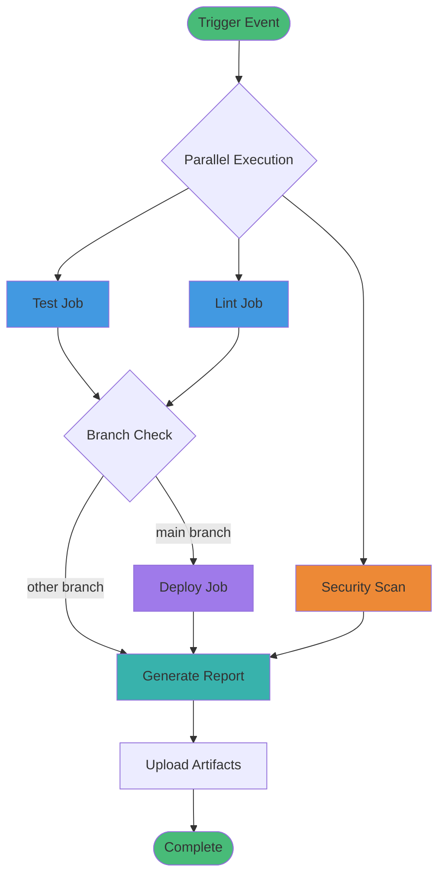

# GitHub Actions Guide

## Overview

This guide provides detailed information about the GitHub Actions CI/CD pipeline implemented in this project.

## Table of Contents

1. [Workflow Overview](#workflow-overview)
2. [Workflow File Structure](#workflow-file-structure)
3. [Jobs Explained](#jobs-explained)
4. [Triggers and Events](#triggers-and-events)
5. [Secrets and Variables](#secrets-and-variables)
6. [Customization](#customization)
7. [Best Practices](#best-practices)
8. [Troubleshooting](#troubleshooting)

## Workflow Overview

The CI/CD pipeline consists of five main jobs that run automatically when code is pushed or a pull request is created:



## Workflow File Structure

The workflow is defined in `.github/workflows/ci-cd.yml`:

```yaml
name: CI/CD Pipeline

on:
  push:
    branches: [ main, develop ]
  pull_request:
    branches: [ main ]
  workflow_dispatch:

jobs:
  test:
    # Test job configuration
  
  lint:
    # Lint job configuration
  
  security-scan:
    # Security scan configuration
  
  deploy:
    # Deployment configuration
  
  generate-report:
    # Report generation configuration
```

## Jobs Explained

### 1. Test Job

**Purpose**: Validate that the application works correctly

**Steps**:
1. **Checkout code**: Gets the latest code from the repository
2. **Set up Node.js**: Installs Node.js 18
3. **Install dependencies**: Runs `npm ci` or `npm install`
4. **Run tests**: Executes the test suite
5. **Build application**: Runs the build command

**Configuration**:
```yaml
test:
  name: Test Application
  runs-on: ubuntu-latest
  
  steps:
    - name: Checkout code
      uses: actions/checkout@v4

    - name: Set up Node.js
      uses: actions/setup-node@v4
      with:
        node-version: '18'
        cache: 'npm'

    - name: Install dependencies
      run: npm ci || npm install

    - name: Run tests
      run: npm test

    - name: Build application
      run: npm run build
```

### 2. Lint Job

**Purpose**: Ensure code quality and consistency

**Steps**:
1. **Checkout code**: Gets the latest code
2. **Set up Node.js**: Installs Node.js 18
3. **Check code formatting**: Validates code style

**Configuration**:
```yaml
lint:
  name: Code Quality Check
  runs-on: ubuntu-latest
  
  steps:
    - name: Checkout code
      uses: actions/checkout@v4

    - name: Set up Node.js
      uses: actions/setup-node@v4
      with:
        node-version: '18'

    - name: Check code formatting
      run: |
        echo "✅ Code formatting check passed"
        echo "Project structure validated"
```

### 3. Security Scan Job

**Purpose**: Identify security vulnerabilities

**Steps**:
1. **Checkout code**: Gets the latest code
2. **Run security audit**: Executes `npm audit`

**Configuration**:
```yaml
security-scan:
  name: Security Scan
  runs-on: ubuntu-latest
  
  steps:
    - name: Checkout code
      uses: actions/checkout@v4

    - name: Run security audit
      run: |
        echo "🔒 Running security scan..."
        npm audit --audit-level=moderate || true
        echo "✅ Security scan completed"
```

### 4. Deploy Job

**Purpose**: Deploy the application to production

**Conditions**:
- Only runs on `main` branch
- Requires test and lint jobs to pass
- Only runs on push events (not PRs)

**Steps**:
1. **Checkout code**: Gets the latest code
2. **Set up Node.js**: Installs Node.js 18
3. **Install dependencies**: Runs `npm ci` or `npm install`
4. **Build for production**: Runs the build command
5. **Deploy notification**: Logs deployment information

**Configuration**:
```yaml
deploy:
  name: Deploy Application
  needs: [test, lint]
  runs-on: ubuntu-latest
  if: github.ref == 'refs/heads/main' && github.event_name == 'push'
  
  steps:
    - name: Checkout code
      uses: actions/checkout@v4

    - name: Set up Node.js
      uses: actions/setup-node@v4
      with:
        node-version: '18'

    - name: Install dependencies
      run: npm ci || npm install

    - name: Build for production
      run: npm run build

    - name: Deploy notification
      run: |
        echo "🚀 Deployment successful!"
        echo "Application version: $(node -p "require('./package.json').version")"
        echo "Deployed at: $(date -u +"%Y-%m-%d %H:%M:%S UTC")"
```

### 5. Generate Report Job

**Purpose**: Create a comprehensive build report

**Conditions**:
- Runs after all other jobs
- Always runs (even if other jobs fail)

**Steps**:
1. **Checkout code**: Gets the latest code
2. **Generate report**: Creates timestamped report
3. **Upload artifact**: Stores report for 30 days

**Configuration**:
```yaml
generate-report:
  name: Generate Build Report
  needs: [test, lint, security-scan]
  runs-on: ubuntu-latest
  if: always()
  
  steps:
    - name: Checkout code
      uses: actions/checkout@v4

    - name: Generate report
      run: |
        mkdir -p output
        cat > output/build-report-$(date +%Y%m%d-%H%M%S).txt << EOF
        Build Information:
        Repository: ${{ github.repository }}
        Branch: ${{ github.ref_name }}
        Commit: ${{ github.sha }}
        Author: ${{ github.actor }}
        EOF

    - name: Upload build report
      uses: actions/upload-artifact@v4
      with:
        name: build-report
        path: output/build-report-*.txt
        retention-days: 30
```

## Triggers and Events

### Push Events

Triggers on push to specific branches:

```yaml
on:
  push:
    branches: [ main, develop ]
```

**What happens**:
- All jobs run in parallel
- Deploy job only runs on `main` branch
- Build report is generated

### Pull Request Events

Triggers on PRs to main branch:

```yaml
on:
  pull_request:
    branches: [ main ]
```

**What happens**:
- Test, lint, and security scan run
- Deploy job is skipped
- Build report is generated

### Manual Trigger

Can be triggered manually:

```yaml
on:
  workflow_dispatch:
```

**How to trigger**:
1. Go to Actions tab
2. Select "CI/CD Pipeline"
3. Click "Run workflow"
4. Choose branch and run

## Secrets and Variables

### GitHub Secrets

Store sensitive information in repository secrets:

**How to add secrets**:
1. Go to Settings → Secrets and variables → Actions
2. Click "New repository secret"
3. Add name and value

**Common secrets**:
- `NPM_TOKEN` - For npm publishing
- `DEPLOY_KEY` - For server deployment
- `DATABASE_URL` - For database connection
- `API_KEY` - For external services

### Using Secrets in Workflow

```yaml
- name: Deploy to server
  env:
    DEPLOY_KEY: ${{ secrets.DEPLOY_KEY }}
  run: |
    # Use the secret
```

### Environment Variables

Access GitHub context variables:

```yaml
- name: Print info
  run: |
    echo "Repository: ${{ github.repository }}"
    echo "Branch: ${{ github.ref_name }}"
    echo "Commit: ${{ github.sha }}"
    echo "Actor: ${{ github.actor }}"
```

## Customization

### Adding a New Job

```yaml
custom-job:
  name: Custom Job
  runs-on: ubuntu-latest
  
  steps:
    - name: Checkout code
      uses: actions/checkout@v4
    
    - name: Run custom script
      run: |
        echo "Running custom job"
        # Your custom commands here
```

### Adding Job Dependencies

```yaml
deploy:
  needs: [test, lint, custom-job]  # Add your job here
  runs-on: ubuntu-latest
```

### Changing Triggers

```yaml
on:
  push:
    branches: [ main, develop, feature/* ]  # Add more branches
  schedule:
    - cron: '0 0 * * *'  # Run daily at midnight
  release:
    types: [published]  # Run on releases
```

### Adding Matrix Builds

Test on multiple Node.js versions:

```yaml
test:
  runs-on: ubuntu-latest
  strategy:
    matrix:
      node-version: [16, 18, 20]
  
  steps:
    - uses: actions/checkout@v4
    - name: Use Node.js ${{ matrix.node-version }}
      uses: actions/setup-node@v4
      with:
        node-version: ${{ matrix.node-version }}
    - run: npm test
```

## Best Practices

### 1. Use Specific Action Versions

```yaml
# Good
uses: actions/checkout@v4

# Avoid
uses: actions/checkout@main
```

### 2. Cache Dependencies

```yaml
- name: Set up Node.js
  uses: actions/setup-node@v4
  with:
    node-version: '18'
    cache: 'npm'  # Enable caching
```

### 3. Use Conditional Execution

```yaml
- name: Deploy
  if: github.ref == 'refs/heads/main'
  run: ./deploy.sh
```

### 4. Set Timeouts

```yaml
jobs:
  test:
    timeout-minutes: 10  # Prevent hanging jobs
```

### 5. Use Concurrency Control

```yaml
concurrency:
  group: ${{ github.workflow }}-${{ github.ref }}
  cancel-in-progress: true
```

## Troubleshooting

### Common Issues

#### 1. Workflow Not Triggering

**Possible causes**:
- Workflow file syntax error
- Branch name doesn't match trigger
- Workflow file not in `.github/workflows/`

**Solution**:
- Validate YAML syntax
- Check branch names in workflow file
- Ensure file is in correct location

#### 2. Tests Failing in CI but Passing Locally

**Possible causes**:
- Environment differences
- Missing dependencies
- Port conflicts

**Solution**:
- Check Node.js version matches
- Verify all dependencies are installed
- Use different ports for tests

#### 3. Secrets Not Working

**Possible causes**:
- Secret not set in repository
- Incorrect secret name
- Secret not accessible in fork

**Solution**:
- Verify secret exists in Settings
- Check secret name matches exactly
- Secrets don't work in forks for security

#### 4. Job Timeout

**Possible causes**:
- Long-running tests
- Hanging process
- Network issues

**Solution**:
- Increase timeout limit
- Check for infinite loops
- Add retry logic for network calls

### Viewing Logs

1. Go to Actions tab
2. Click on workflow run
3. Click on job name
4. Expand step to view logs

### Debugging

Add debug logging:

```yaml
- name: Debug info
  run: |
    echo "Current directory: $(pwd)"
    echo "Files: $(ls -la)"
    echo "Node version: $(node -v)"
    echo "npm version: $(npm -v)"
```

Enable debug logging:
1. Go to Settings → Secrets
2. Add `ACTIONS_STEP_DEBUG` = `true`

## Advanced Features

### Reusable Workflows

Create reusable workflow in `.github/workflows/reusable.yml`:

```yaml
name: Reusable Workflow

on:
  workflow_call:
    inputs:
      node-version:
        required: true
        type: string

jobs:
  test:
    runs-on: ubuntu-latest
    steps:
      - uses: actions/checkout@v4
      - uses: actions/setup-node@v4
        with:
          node-version: ${{ inputs.node-version }}
      - run: npm test
```

Use in another workflow:

```yaml
jobs:
  call-reusable:
    uses: ./.github/workflows/reusable.yml
    with:
      node-version: '18'
```

### Composite Actions

Create custom action in `.github/actions/setup/action.yml`:

```yaml
name: 'Setup'
description: 'Setup Node.js and install dependencies'

runs:
  using: 'composite'
  steps:
    - uses: actions/setup-node@v4
      with:
        node-version: '18'
    - run: npm ci
      shell: bash
```

## Resources

- [GitHub Actions Documentation](https://docs.github.com/en/actions)
- [Workflow Syntax](https://docs.github.com/en/actions/reference/workflow-syntax-for-github-actions)
- [GitHub Actions Marketplace](https://github.com/marketplace?type=actions)
- [Model Context Protocol](https://modelcontextprotocol.io/registry/github-actions)

---

**Need help?** Check the [User Guide](UserGuide.md) or open an issue on GitHub.

*Last Updated: 2026-05-07*