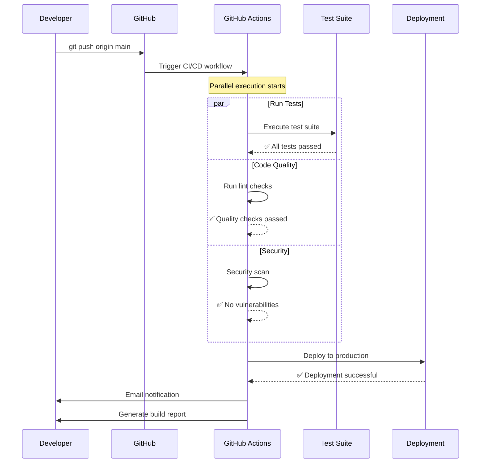

# User Guide - Hello World GitHub Actions Demo

## Introduction

Welcome to the Hello World GitHub Actions Demo! This guide will help you understand how to use, deploy, and customize this application.

## Table of Contents

1. [Getting Started](#getting-started)
2. [Using the Application](#using-the-application)
3. [Understanding GitHub Actions](#understanding-github-actions)
4. [Customization Guide](#customization-guide)
5. [Troubleshooting](#troubleshooting)
6. [FAQ](#faq)

## Getting Started

### System Requirements

- **Node.js**: Version 18 or higher
- **npm**: Comes bundled with Node.js
- **Git**: For version control
- **GitHub Account**: For CI/CD automation

### Installation Steps

1. **Clone the Repository**
   ```bash
   git clone https://github.com/yourusername/hello-world-github-actions-demo.git
   cd hello-world-github-actions-demo
   ```

2. **Verify Node.js Installation**
   ```bash
   node --version  # Should show v18.x.x or higher
   npm --version   # Should show 9.x.x or higher
   ```

3. **Install Dependencies** (if any)
   ```bash
   npm install
   ```

4. **Start the Application**
   ```bash
   npm start
   ```

   You should see:
   ```
   ╔════════════════════════════════════════════════════════╗
   ║                                                        ║
   ║          🚀 Hello World Server Started! 🚀            ║
   ║                                                        ║
   ╚════════════════════════════════════════════════════════╝
   
   📍 Server running at: http://localhost:3000
   🏥 Health check: http://localhost:3000/health
   🔌 API endpoint: http://localhost:3000/api/hello
   ```

## Using the Application

### Web Interface

1. Open your browser and navigate to `http://localhost:3000`
2. You'll see a beautiful, animated "Hello World" page
3. The page displays:
   - Welcome message
   - Application version
   - Current timestamp
   - Information about GitHub Actions

### API Endpoint

**Making API Requests**

Using curl:
```bash
curl http://localhost:3000/api/hello
```

Using JavaScript (fetch):
```javascript
fetch('http://localhost:3000/api/hello')
  .then(response => response.json())
  .then(data => console.log(data));
```

**Expected Response**:
```json
{
  "message": "Hello World!",
  "version": "1.0.0",
  "timestamp": "2026-05-07T14:52:34.165Z",
  "status": "success"
}
```

### Health Check Endpoint

Monitor application health:

```bash
curl http://localhost:3000/health
```

**Response**:
```json
{
  "status": "healthy",
  "uptime": 123.456,
  "timestamp": "2026-05-07T14:52:34.165Z"
}
```

### Stopping the Application

Press `Ctrl+C` in the terminal where the server is running. You'll see:
```
🛑 SIGINT signal received: closing HTTP server
✅ HTTP server closed
```

## Understanding GitHub Actions

### What Happens When You Push Code?



### Workflow Jobs Explained

#### 1. Test Job
- **Purpose**: Ensure code works correctly
- **Steps**:
  1. Checkout code from repository
  2. Set up Node.js environment
  3. Install dependencies
  4. Run test suite
  5. Build application

#### 2. Lint Job
- **Purpose**: Maintain code quality
- **Steps**:
  1. Checkout code
  2. Set up Node.js
  3. Check code formatting
  4. Validate project structure

#### 3. Security Scan Job
- **Purpose**: Identify vulnerabilities
- **Steps**:
  1. Checkout code
  2. Run npm audit
  3. Report security issues

#### 4. Deploy Job
- **Purpose**: Deploy to production
- **Conditions**: Only runs on main branch
- **Steps**:
  1. Checkout code
  2. Install dependencies
  3. Build for production
  4. Deploy application
  5. Send notification

#### 5. Generate Report Job
- **Purpose**: Create build documentation
- **Steps**:
  1. Collect job results
  2. Generate timestamped report
  3. Upload as artifact

### Viewing Workflow Results

1. Go to your GitHub repository
2. Click on the "Actions" tab
3. Select a workflow run
4. View job details and logs
5. Download build reports from artifacts

## Customization Guide

### Changing the Port

Edit `src/index.js`:
```javascript
const PORT = process.env.PORT || 3000; // Change 3000 to your desired port
```

Or set environment variable:
```bash
PORT=8080 npm start
```

### Modifying the Welcome Message

Edit `src/index.js`, find the HTML section:
```javascript
<h1>🎉 Hello World! 🎉</h1>
```

Change to:
```javascript
<h1>🎉 Welcome to My App! 🎉</h1>
```

### Adding New Endpoints

Add a new route in `src/index.js`:
```javascript
else if (req.url === '/api/custom') {
  res.writeHead(200, { 'Content-Type': 'application/json' });
  res.end(JSON.stringify({
    message: 'Custom endpoint',
    data: 'Your data here'
  }));
}
```

### Customizing GitHub Actions

Edit `.github/workflows/ci-cd.yml`:

**Add a new job**:
```yaml
custom-job:
  name: Custom Job
  runs-on: ubuntu-latest
  steps:
    - name: Checkout code
      uses: actions/checkout@v4
    
    - name: Run custom script
      run: echo "Running custom job"
```

**Change workflow triggers**:
```yaml
on:
  push:
    branches: [ main, develop, feature/* ]  # Add more branches
  schedule:
    - cron: '0 0 * * *'  # Run daily at midnight
```

### Adding Tests

Add new tests in `src/test.js`:
```javascript
// Test 5: Custom endpoint
console.log('\nTest 5: Custom endpoint returns data...');
const customResponse = await makeRequest('/api/custom');
if (customResponse.statusCode === 200) {
  console.log('✅ PASS: Custom endpoint works');
  testsPassed++;
} else {
  console.log('❌ FAIL: Custom endpoint failed');
  testsFailed++;
}
```

## Troubleshooting

### Common Issues

#### Port Already in Use

**Error**: `EADDRINUSE: address already in use`

**Solution**:
```bash
# Find process using the port
lsof -i :3000

# Kill the process
kill -9 <PID>

# Or use a different port
PORT=3001 npm start
```

#### Tests Failing

**Error**: Tests fail locally or in CI/CD

**Solution**:
1. Run tests locally: `npm test`
2. Check test output for specific failures
3. Verify all endpoints are working
4. Ensure no port conflicts

#### GitHub Actions Not Triggering

**Possible Causes**:
- Workflow file syntax error
- Branch name doesn't match trigger
- Repository permissions issue

**Solution**:
1. Validate YAML syntax
2. Check workflow triggers in `.github/workflows/ci-cd.yml`
3. Verify repository settings → Actions → General

#### Build Artifacts Not Appearing

**Solution**:
1. Check workflow completed successfully
2. Look in Actions → Workflow run → Artifacts section
3. Artifacts expire after 30 days

### Getting Help

1. **Check Logs**: Review GitHub Actions logs for errors
2. **Test Locally**: Run `npm test` to verify functionality
3. **Review Documentation**: Check [Architecture.md](Architecture.md)
4. **Open Issue**: Create a GitHub issue with details

## FAQ

### Q: Can I use this with other languages?

**A**: Yes! The GitHub Actions workflow can be adapted for any language. Just modify the workflow steps to use the appropriate setup actions (e.g., `setup-python`, `setup-java`).

### Q: How do I deploy to a real server?

**A**: Add deployment steps to the workflow:
```yaml
- name: Deploy to server
  run: |
    # Add your deployment commands
    ssh user@server 'cd /app && git pull && npm install && pm2 restart app'
```

### Q: Can I add a database?

**A**: Absolutely! Add database connection code to `src/index.js` and update the workflow to include database setup steps.

### Q: How do I add environment variables?

**A**: 
1. Create a `.env` file (already in .gitignore)
2. Add variables: `DATABASE_URL=your_url`
3. Load in code: `require('dotenv').config()`
4. Add to GitHub Secrets for CI/CD

### Q: What if I want to use TypeScript?

**A**: 
1. Install TypeScript: `npm install -D typescript @types/node`
2. Add `tsconfig.json`
3. Rename files to `.ts`
4. Update workflow to include build step

### Q: How do I add more tests?

**A**: Edit `src/test.js` and add new test cases following the existing pattern. Each test should check a specific functionality.

### Q: Can I use this for production?

**A**: This is a demo application. For production:
- Add proper error handling
- Implement logging
- Add security headers
- Use a process manager (PM2)
- Add monitoring and alerting
- Implement rate limiting
- Add authentication if needed

## Next Steps

1. **Explore the Code**: Review `src/index.js` to understand the implementation
2. **Customize**: Modify the application to fit your needs
3. **Deploy**: Push to GitHub and watch the automation work
4. **Extend**: Add new features and endpoints
5. **Share**: Use this as a template for your projects

## Additional Resources

- [GitHub Actions Documentation](https://docs.github.com/en/actions)
- [Node.js Best Practices](https://github.com/goldbergyoni/nodebestpractices)
- [Model Context Protocol](https://modelcontextprotocol.io/)
- [Project Architecture](Architecture.md)

---

**Happy Coding! 🚀**

*Last Updated: 2026-05-07*