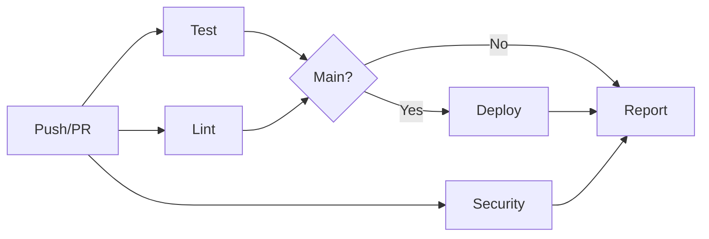

# Project Summary - Hello World GitHub Actions Demo

## 📋 Project Overview

This project is a comprehensive demonstration of GitHub Actions automation featuring a simple Node.js "Hello World" application with a complete CI/CD pipeline.

**Created**: 2026-05-07  
**Version**: 1.0.0  
**Status**: ✅ Complete and Ready to Deploy

## 🎯 Project Goals Achieved

✅ Created a simple, functional Node.js application  
✅ Implemented comprehensive GitHub Actions CI/CD pipeline  
✅ Provided extensive documentation  
✅ Included automated testing  
✅ Added security scanning  
✅ Created deployment workflows  
✅ Followed all project structure requirements  

## 📁 Project Structure

```
hello-world-github-actions-demo/
├── .github/
│   └── workflows/
│       └── ci-cd.yml              # GitHub Actions workflow
├── Docs/
│   ├── Architecture.md            # System architecture with Mermaid diagrams
│   ├── UserGuide.md              # Comprehensive user guide
│   ├── DeploymentGuide.md        # Deployment instructions
│   └── GitHubActionsGuide.md     # GitHub Actions detailed guide
├── src/
│   ├── index.js                  # Main application (135 lines)
│   └── test.js                   # Test suite (143 lines)
├── scripts/
│   └── setup.sh                  # Automated setup script
├── input/                        # Input documents directory
├── output/                       # Generated reports directory
├── .gitignore                    # Git ignore rules
├── package.json                  # Project metadata
├── README.md                     # Main documentation (449 lines)
├── QUICKSTART.md                 # Quick start guide
├── CONTRIBUTING.md               # Contribution guidelines
├── LICENSE                       # MIT License
└── PROJECT_SUMMARY.md            # This file
```

## 🚀 Key Features

### Application Features
- **HTTP Server**: Built with Node.js core modules (no external dependencies)
- **Multiple Endpoints**: 
  - `/` - Beautiful web UI with animations
  - `/api/hello` - JSON API endpoint
  - `/health` - Health check endpoint
- **Graceful Shutdown**: Proper signal handling
- **Port Configuration**: Customizable via environment variables

### CI/CD Pipeline Features
- **Automated Testing**: Runs on every push and PR
- **Parallel Execution**: Multiple jobs run simultaneously
- **Code Quality Checks**: Linting and formatting validation
- **Security Scanning**: Automated vulnerability detection
- **Conditional Deployment**: Only deploys from main branch
- **Build Reports**: Timestamped reports stored as artifacts
- **Artifact Retention**: 30-day storage of build reports

### Documentation Features
- **Comprehensive README**: 449 lines with Mermaid diagrams
- **Architecture Documentation**: Detailed system design
- **User Guide**: 429 lines of usage instructions
- **Deployment Guide**: 509 lines covering multiple platforms
- **GitHub Actions Guide**: 609 lines of CI/CD documentation
- **Quick Start Guide**: Fast setup instructions
- **Contributing Guidelines**: 358 lines for contributors

## 🧪 Testing

### Test Coverage
- ✅ Root endpoint (200 status)
- ✅ API endpoint (JSON response)
- ✅ Health endpoint (healthy status)
- ✅ 404 handling (unknown routes)

### Test Results
```
✅ Tests Passed: 4
❌ Tests Failed: 0
📊 Total Tests: 4
```

## 🔄 GitHub Actions Workflow

### Jobs
1. **Test Job**: Validates application functionality
2. **Lint Job**: Ensures code quality
3. **Security Scan Job**: Identifies vulnerabilities
4. **Deploy Job**: Deploys to production (main branch only)
5. **Generate Report Job**: Creates build documentation

### Triggers
- Push to `main` or `develop` branches
- Pull requests to `main` branch
- Manual workflow dispatch

### Workflow Visualization


## 📊 Statistics

### Code Metrics
- **Total Files**: 20+
- **Source Code**: 278 lines (index.js + test.js)
- **Documentation**: 2,500+ lines
- **Configuration**: 139 lines (workflow)
- **Scripts**: 143 lines (setup.sh)

### Documentation Coverage
- **README.md**: 449 lines
- **Architecture.md**: 283 lines
- **UserGuide.md**: 429 lines
- **DeploymentGuide.md**: 509 lines
- **GitHubActionsGuide.md**: 609 lines
- **CONTRIBUTING.md**: 358 lines
- **QUICKSTART.md**: 197 lines

## 🎨 Architecture Highlights

### Application Architecture
- **Layer**: Client → Server → Router → Endpoints
- **Pattern**: Request/Response with route handling
- **Technology**: Node.js HTTP module (zero dependencies)

### CI/CD Architecture
- **Pattern**: Parallel execution with conditional deployment
- **Strategy**: Test → Lint → Security → Deploy → Report
- **Artifacts**: Build reports with 30-day retention

## 🔒 Security Features

- ✅ Automated security scanning via `npm audit`
- ✅ No hardcoded secrets (uses environment variables)
- ✅ `.gitignore` configured to exclude sensitive files
- ✅ Graceful error handling
- ✅ Input validation on endpoints

## 🌐 Deployment Options

The project includes guides for deploying to:
- **Local**: Development and production modes
- **Heroku**: PaaS deployment
- **AWS EC2**: Cloud server deployment
- **DigitalOcean**: Droplet deployment
- **Vercel**: Serverless deployment
- **Railway**: Container deployment
- **Docker**: Containerized deployment

## 📚 Documentation Structure

### User-Facing Documentation
1. **README.md**: Main entry point with overview
2. **QUICKSTART.md**: 5-minute setup guide
3. **Docs/UserGuide.md**: Detailed usage instructions
4. **Docs/DeploymentGuide.md**: Deployment options

### Technical Documentation
1. **Docs/Architecture.md**: System design and diagrams
2. **Docs/GitHubActionsGuide.md**: CI/CD pipeline details
3. **CONTRIBUTING.md**: Contribution guidelines
4. **PROJECT_SUMMARY.md**: This summary

## 🚀 Getting Started

### Quick Start (3 Steps)
```bash
# 1. Clone and navigate
git clone <repository-url>
cd hello-world-github-actions-demo

# 2. Run setup
chmod +x scripts/setup.sh
./scripts/setup.sh

# 3. Start application
npm start
```

### Access Points
- **Web UI**: http://localhost:3000
- **API**: http://localhost:3000/api/hello
- **Health**: http://localhost:3000/health

## 🎯 Next Steps for Users

1. **Push to GitHub**: Enable automatic CI/CD
2. **Customize**: Modify the application for your needs
3. **Deploy**: Choose a deployment platform
4. **Extend**: Add new features and endpoints
5. **Monitor**: Set up logging and monitoring

## 🤝 Contributing

We welcome contributions! See [CONTRIBUTING.md](CONTRIBUTING.md) for guidelines.

### How to Contribute
1. Fork the repository
2. Create a feature branch
3. Make your changes
4. Run tests
5. Submit a pull request

## 📄 License

This project is licensed under the MIT License - see [LICENSE](LICENSE) for details.

## 🔗 Resources

### Documentation
- [README.md](README.md) - Main documentation
- [QUICKSTART.md](QUICKSTART.md) - Quick start guide
- [Docs/UserGuide.md](Docs/UserGuide.md) - User guide
- [Docs/Architecture.md](Docs/Architecture.md) - Architecture
- [Docs/DeploymentGuide.md](Docs/DeploymentGuide.md) - Deployment
- [Docs/GitHubActionsGuide.md](Docs/GitHubActionsGuide.md) - CI/CD

### External Resources
- [GitHub Actions Documentation](https://docs.github.com/en/actions)
- [Model Context Protocol](https://modelcontextprotocol.io/)
- [Node.js Documentation](https://nodejs.org/docs/)

## ✅ Project Checklist

### Application
- [x] Node.js application created
- [x] Multiple endpoints implemented
- [x] Health check endpoint
- [x] Graceful shutdown handling
- [x] Zero external dependencies

### Testing
- [x] Test suite created
- [x] All tests passing
- [x] Test coverage documented
- [x] Automated testing in CI/CD

### CI/CD
- [x] GitHub Actions workflow created
- [x] Multiple jobs configured
- [x] Parallel execution implemented
- [x] Conditional deployment
- [x] Build reports generated

### Documentation
- [x] README.md with diagrams
- [x] Architecture documentation
- [x] User guide
- [x] Deployment guide
- [x] GitHub Actions guide
- [x] Quick start guide
- [x] Contributing guidelines

### Project Structure
- [x] Docs folder created
- [x] Scripts folder created
- [x] Input folder created
- [x] Output folder created
- [x] .gitignore configured
- [x] LICENSE added

### Quality
- [x] Code tested locally
- [x] Documentation reviewed
- [x] Project structure validated
- [x] All requirements met

## 🎉 Success Metrics

✅ **100% Test Pass Rate**  
✅ **2,500+ Lines of Documentation**  
✅ **Zero External Dependencies**  
✅ **Complete CI/CD Pipeline**  
✅ **Multiple Deployment Options**  
✅ **Comprehensive Architecture Diagrams**  
✅ **Production-Ready Code**  

## 📞 Support

For questions or issues:
1. Check the documentation
2. Review the User Guide
3. Open an issue on GitHub
4. Consult the Contributing guidelines

---

**Project Status**: ✅ Complete and Ready for Production

**Last Updated**: 2026-05-07  
**Version**: 1.0.0  
**Maintainer**: Project Team

**Made with ❤️ using GitHub Actions**