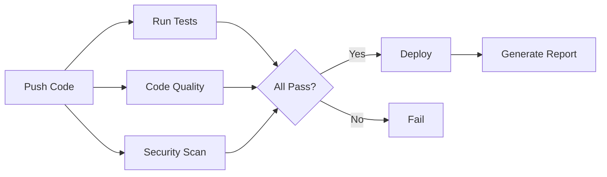

# Quick Start Guide

Get up and running with the Hello World GitHub Actions Demo in 5 minutes!

## 🚀 Quick Setup

### Option 1: Automated Setup (Recommended)

```bash
# Clone the repository
git clone https://github.com/yourusername/hello-world-github-actions-demo.git
cd hello-world-github-actions-demo

# Run setup script
chmod +x scripts/setup.sh
./scripts/setup.sh

# Start the application
npm start
```

### Option 2: Manual Setup

```bash
# Clone the repository
git clone https://github.com/yourusername/hello-world-github-actions-demo.git
cd hello-world-github-actions-demo

# Create directories
mkdir -p input output

# Run tests
npm test

# Start the application
npm start
```

## 🌐 Access the Application

Once started, open your browser:

- **Web UI**: http://localhost:3000
- **API**: http://localhost:3000/api/hello
- **Health Check**: http://localhost:3000/health

## 🧪 Test the API

### Using curl

```bash
# Get Hello World message
curl http://localhost:3000/api/hello

# Check health
curl http://localhost:3000/health
```

### Using JavaScript

```javascript
// Fetch API
fetch('http://localhost:3000/api/hello')
  .then(res => res.json())
  .then(data => console.log(data));
```

## 🔄 GitHub Actions Setup

### 1. Push to GitHub

```bash
# Initialize git (if not already done)
git init

# Add remote
git remote add origin https://github.com/yourusername/hello-world-github-actions-demo.git
# git remote add origin https://github.com/aairom/hello-world-github-actions-demo.git

# Add and commit
git add .
git commit -m "Initial commit: Hello World with GitHub Actions"

# Push to GitHub
git push -u origin main

# To restart all over again
rm -rf .git
```

### 2. View Workflow

1. Go to your repository on GitHub
2. Click the **Actions** tab
3. Watch your CI/CD pipeline run automatically!

### 3. Workflow Triggers

The workflow runs automatically on:
- ✅ Push to `main` or `develop` branches
- ✅ Pull requests to `main`
- ✅ Manual trigger (workflow_dispatch)

## 📊 What Happens in CI/CD?



## 🎯 Next Steps

1. **Explore the Code**
   - Check out [`src/index.js`](src/index.js) - Main application
   - Review [`src/test.js`](src/test.js) - Test suite
   - Examine [`.github/workflows/ci-cd.yml`](.github/workflows/ci-cd.yml) - CI/CD workflow

2. **Read Documentation**
   - [README.md](README.md) - Full project overview
   - [Docs/UserGuide.md](Docs/UserGuide.md) - Detailed user guide
   - [Docs/Architecture.md](Docs/Architecture.md) - Architecture details
   - [Docs/DeploymentGuide.md](Docs/DeploymentGuide.md) - Deployment options

3. **Customize**
   - Modify the welcome message
   - Add new endpoints
   - Extend the CI/CD pipeline
   - Add your own features

4. **Deploy**
   - Follow the [Deployment Guide](Docs/DeploymentGuide.md)
   - Choose from multiple deployment options
   - Set up monitoring and logging

## 🛠️ Common Commands

```bash
# Start the application
npm start

# Run tests
npm test

# Build (if needed)
npm run build

# Run with custom port
PORT=8080 npm start

# Run setup script
./scripts/setup.sh
```

## 🐛 Troubleshooting

### Port Already in Use

```bash
# Find and kill process on port 3000
lsof -ti:3000 | xargs kill -9

# Or use a different port
PORT=3001 npm start
```

### Tests Failing

```bash
# Run tests with verbose output
npm test

# Check if server is already running
lsof -i:3001
```

### GitHub Actions Not Running

1. Check the Actions tab in your repository
2. Verify the workflow file syntax
3. Ensure you pushed to the correct branch

## 📚 Resources

- [GitHub Actions Documentation](https://docs.github.com/en/actions)
- [Node.js Documentation](https://nodejs.org/docs/)
- [Model Context Protocol](https://modelcontextprotocol.io/)

## 💡 Tips

- Use `Ctrl+C` to stop the server
- Check logs for debugging
- Run tests before pushing code
- Review GitHub Actions logs for CI/CD issues

## 🤝 Need Help?

- Check the [User Guide](Docs/UserGuide.md)
- Review [Contributing Guidelines](CONTRIBUTING.md)
- Open an issue on GitHub

---

**Ready to build something amazing? Let's go! 🚀**