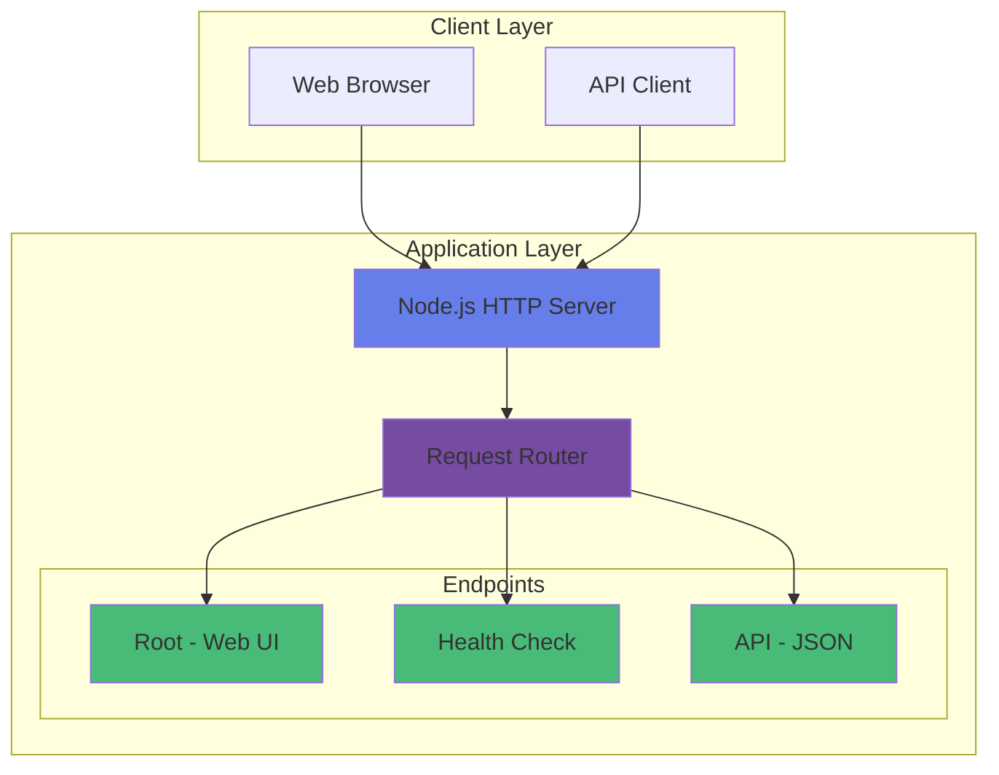
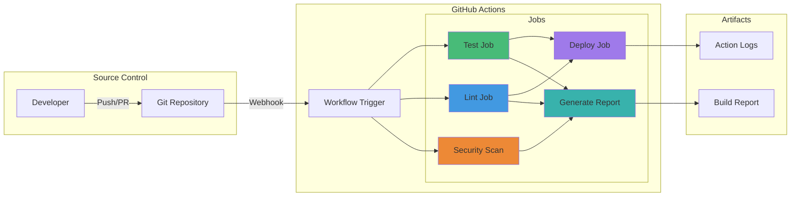
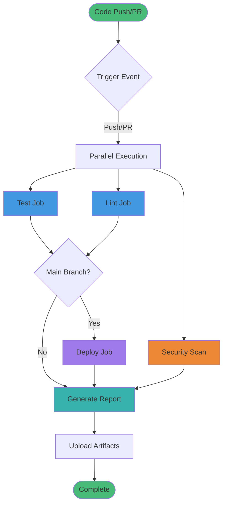
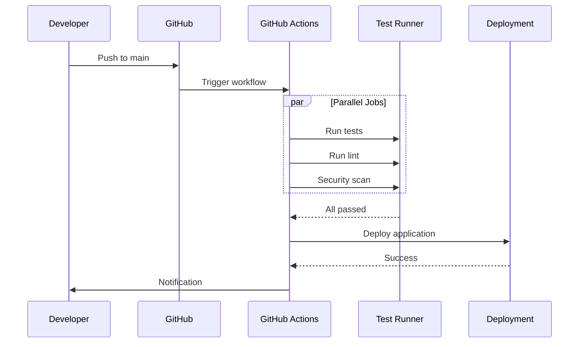

# Hello World - GitHub Actions Demo 🚀

A comprehensive demonstration of GitHub Actions automation with a simple Node.js "Hello World" application. This project showcases CI/CD best practices, automated testing, security scanning, and deployment workflows.

[](https://github.com/features/actions)
[](https://nodejs.org/)
[](LICENSE)

## 📋 Table of Contents

- [Overview](#overview)
- [Features](#features)
- [Architecture](#architecture)
- [Quick Start](#quick-start)
- [Project Structure](#project-structure)
- [GitHub Actions Workflow](#github-actions-workflow)
- [API Endpoints](#api-endpoints)
- [Testing](#testing)
- [Deployment](#deployment)
- [Contributing](#contributing)
- [License](#license)

## 🎯 Overview

This project demonstrates a complete CI/CD pipeline using GitHub Actions for a simple Node.js application. It includes:

- ✅ Automated testing
- 🔍 Code quality checks
- 🔒 Security vulnerability scanning
- 🚀 Automated deployment
- 📊 Build report generation
- 🏥 Health monitoring endpoints

## ✨ Features

### Application Features
- **Web Interface**: Beautiful, responsive HTML interface
- **REST API**: JSON API endpoint for programmatic access
- **Health Checks**: Monitoring endpoint for application health
- **Graceful Shutdown**: Proper signal handling for clean shutdowns
- **Zero Dependencies**: Built with Node.js core modules only

### CI/CD Features
- **Automated Testing**: Runs on every push and pull request
- **Parallel Execution**: Multiple jobs run simultaneously
- **Security Scanning**: Automated vulnerability detection
- **Conditional Deployment**: Deploys only from main branch
- **Artifact Storage**: Build reports stored for 30 days
- **Comprehensive Logging**: Detailed execution logs

## 🏗️ Architecture

### Application Architecture



### CI/CD Pipeline



For detailed architecture documentation, see [Architecture.md](Docs/Architecture.md).

## 🚀 Quick Start

### Prerequisites

- Node.js 18 or higher
- npm (comes with Node.js)
- Git

### Installation

1. **Clone the repository**
   ```bash
   git clone https://github.com/yourusername/hello-world-github-actions-demo.git
   cd hello-world-github-actions-demo
   ```

2. **Install dependencies** (if any are added in the future)
   ```bash
   npm install
   ```

3. **Run the application**
   ```bash
   npm start
   ```

4. **Access the application**
   - Web UI: http://localhost:3000
   - API: http://localhost:3000/api/hello
   - Health: http://localhost:3000/health

### Running Tests

```bash
npm test
```

### Building

```bash
npm run build
```

## 📁 Project Structure

```
hello-world-github-actions-demo/
├── .github/
│   └── workflows/
│       └── ci-cd.yml          # GitHub Actions workflow
├── Docs/
│   ├── Architecture.md        # Detailed architecture documentation
│   └── UserGuide.md          # User guide (to be created)
├── src/
│   ├── index.js              # Main application file
│   └── test.js               # Test suite
├── scripts/                   # Utility scripts (if needed)
├── input/                     # Input documents
├── output/                    # Generated reports and outputs
├── .gitignore                # Git ignore rules
├── package.json              # Project metadata and dependencies
└── README.md                 # This file
```

## 🔄 GitHub Actions Workflow

The CI/CD pipeline consists of five main jobs:

### 1. **Test Job** 🧪
- Checks out code
- Sets up Node.js environment
- Installs dependencies
- Runs test suite
- Builds the application

### 2. **Lint Job** 📝
- Validates code formatting
- Checks project structure
- Ensures code quality standards

### 3. **Security Scan Job** 🔒
- Runs `npm audit` for vulnerability detection
- Reports security issues
- Continues on moderate-level issues

### 4. **Deploy Job** 🚀
- Runs only on main branch pushes
- Requires test and lint jobs to pass
- Builds for production
- Generates deployment notification

### 5. **Generate Report Job** 📊
- Runs after all other jobs
- Creates timestamped build report
- Uploads report as artifact
- Retains for 30 days

### Workflow Triggers

The workflow runs on:
- Push to `main` or `develop` branches
- Pull requests to `main` branch
- Manual workflow dispatch

### Workflow Visualization



## 🌐 API Endpoints

### Root Endpoint
- **URL**: `/`
- **Method**: GET
- **Response**: HTML web interface
- **Description**: Beautiful, responsive web UI

### API Endpoint
- **URL**: `/api/hello`
- **Method**: GET
- **Response**: JSON
  ```json
  {
    "message": "Hello World!",
    "version": "1.0.0",
    "timestamp": "2026-05-07T14:52:34.165Z",
    "status": "success"
  }
  ```

### Health Check Endpoint
- **URL**: `/health`
- **Method**: GET
- **Response**: JSON
  ```json
  {
    "status": "healthy",
    "uptime": 123.456,
    "timestamp": "2026-05-07T14:52:34.165Z"
  }
  ```

### 404 Handler
- **URL**: Any undefined route
- **Method**: Any
- **Response**: 404 Not Found

## 🧪 Testing

The project includes a comprehensive test suite that validates:

1. ✅ Root endpoint returns 200 status
2. ✅ API endpoint returns correct JSON structure
3. ✅ Health endpoint reports healthy status
4. ✅ Unknown routes return 404

### Test Output Example

```
╔════════════════════════════════════════════════════════╗
║                                                        ║
║              🧪 Running Test Suite 🧪                 ║
║                                                        ║
╚════════════════════════════════════════════════════════╝

Test 1: Root endpoint (/) returns 200...
✅ PASS: Root endpoint returns 200

Test 2: API endpoint (/api/hello) returns JSON...
✅ PASS: API endpoint returns correct JSON

Test 3: Health endpoint (/health) returns healthy status...
✅ PASS: Health endpoint returns healthy status

Test 4: Unknown routes return 404...
✅ PASS: Unknown routes return 404

╔════════════════════════════════════════════════════════╗
║                                                        ║
║                   Test Summary                         ║
║                                                        ║
╚════════════════════════════════════════════════════════╝

✅ Tests Passed: 4
❌ Tests Failed: 0
📊 Total Tests: 4
```

## 🚀 Deployment

### Automatic Deployment

The application automatically deploys when:
1. Code is pushed to the `main` branch
2. All tests pass
3. Code quality checks pass
4. Security scan completes

### Manual Deployment

You can manually trigger the workflow:
1. Go to the "Actions" tab in GitHub
2. Select "CI/CD Pipeline"
3. Click "Run workflow"
4. Choose the branch and click "Run workflow"

### Deployment Process



## 📊 Build Reports

Build reports are automatically generated and include:

- Repository information
- Branch and commit details
- Author information
- Job status for all pipeline stages
- Timestamp and run number

Reports are stored as artifacts and retained for 30 days.

## 🤝 Contributing

Contributions are welcome! Please follow these steps:

1. Fork the repository
2. Create a feature branch (`git checkout -b feature/amazing-feature`)
3. Commit your changes (`git commit -m 'Add amazing feature'`)
4. Push to the branch (`git push origin feature/amazing-feature`)
5. Open a Pull Request

### Development Guidelines

- Write tests for new features
- Follow existing code style
- Update documentation as needed
- Ensure all tests pass before submitting PR

## 📝 License

This project is licensed under the MIT License - see the [LICENSE](LICENSE) file for details.

## 🔗 Resources

- [GitHub Actions Documentation](https://docs.github.com/en/actions)
- [Model Context Protocol](https://modelcontextprotocol.io/)
- [Node.js Documentation](https://nodejs.org/docs/)
- [Project Architecture](Docs/Architecture.md)

## 📧 Contact

For questions or feedback, please open an issue on GitHub.

---

**Made with ❤️ using GitHub Actions**

**Version**: 1.0.0  
**Last Updated**: 2026-05-07